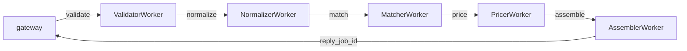

# Proposal Engine

A backend service that accepts field reports from a mobile app and generates structured repair proposal drafts via a deterministic, distributed pipeline.

---

## Starting the service

**Requires:** Docker and Docker Compose.

```bash
git clone <repo-url>
cd xbuild-take-home-1
docker-compose up --build
```

When ready you will see:
```
gateway-1  | INFO:     Application startup complete.
gateway-1  | INFO:     Uvicorn running on http://0.0.0.0:8000
```

| Service | URL |
|---|---|
| API | http://localhost:8000 |
| Interactive API docs | http://localhost:8000/docs |
| RabbitMQ management UI | http://localhost:15672 (guest / guest) |

**To stop:**
```bash
docker-compose down
```

**If you get a "port already allocated" error** (e.g. port 5672 or 15672 in use from a previous run):
```bash
docker-compose down           # stop and remove this project's containers
docker ps -a                  # find any leftover containers using the port
docker rm -f <container-id>   # remove them
docker-compose up --build     # retry
```

**Full reset** (removes containers, volumes, and built images — starts completely fresh):
```bash
docker-compose down --volumes --rmi all
docker-compose up --build
```

---

## API walkthrough

### 1. Submit a field report

```bash
curl -s -X POST http://localhost:8000/reports \
  -H "Content-Type: application/json" \
  -d '{
    "customer": {
      "name": "Jane Smith",
      "email": "jane@example.com"
    },
    "property": {
      "address": "123 Main St, Austin, TX",
      "type": "single_family"
    },
    "findings": [
      {
        "title": "Missing shingles",
        "severity": "high",
        "notes": "Visible damage on north slope",
        "photos": ["photo-1.jpg", "photo-2.jpg"]
      },
      {
        "title": "Clogged gutters",
        "severity": "medium",
        "notes": "",
        "photos": []
      }
    ]
  }'
```

```json
{"reportId": "rpt_9c713301319f"}
```

---

### 2. Retrieve the stored report

```bash
curl -s http://localhost:8000/reports/rpt_9c713301319f
```

---

### 3. Generate a proposal

Triggers the async pipeline (validator → normalizer → matcher → pricer → assembler) over RabbitMQ. Responds when the pipeline completes (typically < 1 second).

```bash
curl -s -X POST http://localhost:8000/reports/rpt_9c713301319f/generate-proposal
```

```json
{"proposalId": "prop_1f9ec4a300c8"}
```

---

### 4. Fetch the proposal

```bash
curl -s http://localhost:8000/proposals/prop_1f9ec4a300c8
```

```json
{
  "proposalId": "prop_1f9ec4a300c8",
  "reportId": "rpt_9c713301319f",
  "version": 1,
  "summary": "Exterior repairs for 123 Main St, Austin, TX",
  "lineItems": [
    {
      "code": "roof.patch_shingles",
      "category": "roofing",
      "description": "Replace missing/damaged shingles in affected areas.",
      "estimatedCost": 1400,
      "sourceFinding": "Missing shingles",
      "matchReason": "Matched keywords: shingle, shingles, missing"
    },
    {
      "code": "gutters.clean_flush",
      "category": "gutters",
      "description": "Clean and flush gutters and downspouts.",
      "estimatedCost": 250,
      "sourceFinding": "Clogged gutters",
      "matchReason": "Matched keywords: gutter, clog, clogged"
    }
  ],
  "total": 1650
}
```

---

### 5. Re-generate a proposal (versioning)

Calling generate-proposal again on the same report creates a new immutable version. The previous proposal remains accessible by its ID.

```bash
curl -s -X POST http://localhost:8000/reports/rpt_9c713301319f/generate-proposal
# → {"proposalId": "prop_cc0ed9b49176"}  (version 2)
```

### 6. View proposal history for a report

```bash
curl -s http://localhost:8000/reports/rpt_9c713301319f/proposals
```

```json
[
  {"proposalId": "prop_1f9ec4a300c8", "version": 1, "createdAt": "2026-05-09T01:03:04Z", "total": 1650},
  {"proposalId": "prop_cc0ed9b49176", "version": 2, "createdAt": "2026-05-09T01:03:15Z", "total": 1650}
]
```

---

### Validation errors

The pipeline validates input before processing. Invalid reports return HTTP 422:

```bash
# Missing customer name + empty findings
curl -s -X POST http://localhost:8000/reports \
  -H "Content-Type: application/json" \
  -d '{"customer": {"name": "", "email": "x@x.com"}, "property": {"address": "1 St", "type": "house"}, "findings": []}'
# → {"reportId": "rpt_..."}
# Report is stored; validation fires on generate-proposal:

curl -s -X POST http://localhost:8000/reports/rpt_.../generate-proposal
# → HTTP 422:
# {
#   "detail": [
#     {"field": "customer.name", "message": "is required"},
#     {"field": "findings", "message": "must be a non-empty array"}
#   ]
# }
```

Severity values must be `low`, `medium`, or `high`. Any other value returns 422.

---

### Scaling a worker

```bash
docker-compose up --scale worker-matcher=3
```

---

## Running tests

### Unit + integration tests (no Docker required)

Create a virtualenv, install test dependencies, then run:

```bash
python -m venv .venv && source .venv/bin/activate
pip install httpx pika pytest fastapi pydantic aio-pika
python -m pytest tests/ --ignore=tests/test_e2e.py -v
```

### End-to-end tests (requires the stack to be running)

With the stack already running (`docker-compose up --build`), in a separate terminal:

```bash
source .venv/bin/activate   # same venv as above
python -m pytest tests/test_e2e.py -v
```

The e2e tests skip automatically if the gateway is not reachable.

---

## Design

### How reports and proposals are modeled

A **report** is the raw input as submitted — customer, property, and a list of findings. It is stored verbatim and never mutated. Each finding is also stored as a normalized row (title, severity, notes, photos as a JSON string array).

A **proposal** is a derived, immutable output generated from a report. It contains one line item per finding, a computed total, and an explicit `matchReason` for every line item explaining which keywords drove the catalog match. Proposals are never updated in place.

The two are linked by `report_id` but intentionally separate: a report is ground truth, a proposal is an interpretation of it. Regenerating a proposal creates a new version — it does not overwrite the previous one.

### Invariants and design decisions

**One line item per finding, always.** The matcher scores each finding against the 10-item catalog using keyword counts. If nothing scores above zero, it falls back to `general.assessment_tm`. This guarantees every valid report produces a complete proposal.

**Deterministic matching.** Given the same finding title and notes, the matcher always returns the same catalog item. Ties (equal keyword scores) are broken by catalog order, which is fixed. This makes proposals reproducible and auditable.

**Proposals are append-only.** Each call to `POST /reports/:id/generate-proposal` inserts a new proposal row with an incrementing version number. Old proposals remain retrievable by their ID. The `GET /reports/:id/proposals` endpoint lists the full history.

**The catalog is data, not code.** The 10 catalog items and their keyword trigger lists live in `workers/matcher/catalog.json`. Non-developers can edit the catalog and redeploy without touching Python. The matching rules remain version-controlled alongside the code that uses them.

**Photos are strings throughout.** No binary storage, no S3 — a photo reference is just a string in the findings array. The photo count affects pricing (via the photo modifier), nothing more.

**SQLite with WAL mode** is shared between the gateway and assembler containers via a named Docker volume. WAL mode allows concurrent reads without blocking the writer.

### Architecture: distributed pipeline over RabbitMQ

Each pipeline step runs as an independent Docker container consuming from its own RabbitMQ queue:



The `PipelineContext` dataclass is the message body — it carries all state as a JSON-serializable dict. Each worker reads from it, enriches it, and publishes it to the next queue. Workers never share memory or call each other directly.

The gateway uses the RabbitMQ **request-reply pattern**: it declares a temporary `reply_{job_id}` queue per request, publishes the initial context, and waits up to 30 seconds for a result. This keeps the gateway stateless.

Any worker can short-circuit the pipeline by publishing directly to `reply_{job_id}` with `status=failed` — the gateway surfaces this as HTTP 422.

### How this evolves

**If proposal generation became async (returning a job ID immediately):** The gateway route already publishes to a queue and waits — the only change needed is to stop waiting. Return `{jobId, status: "pending"}` immediately, persist the `reply_to` queue name, and poll or use a webhook to notify when complete. The workers and pipeline are untouched.

**If AI replaced deterministic matching:** Only `MatcherWorker` changes. Its queue contract is identical — it receives a context with `report_input` and publishes one with `matches`. The `matchReason` field already accommodates free-text LLM reasoning. Every other worker, the gateway, and the DB schema are unaffected.

**Proposal versioning/history:** Already implemented. The `proposals` table is append-only with a `version` column. `GET /reports/:id/proposals` returns the full history. Each `prop_` ID permanently addresses a specific version.
